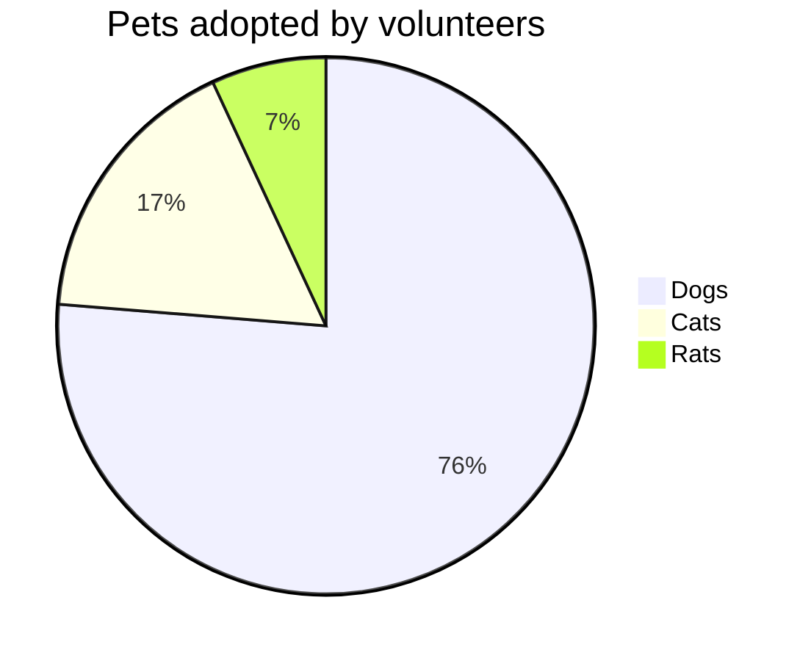

Some random text. Please ignore...

-------

> Normal quote

> Normal
> 
> yet multiline
>
> quote

> ### Normal quote with header
> and some text bellow

> 🥶 A generic hint. Will be vaguely highlighted.

> ⚠️ An important warning

> 💡 A smart tip

> ☠️ A deprecation notice

> 🛠️ A currently in-develop notice
>
> That happens to be multiline
>
> Cool, right?
>
> Yeah...

----

> #### 👪 A generic hint
> Will be vaguely highlighted.

> #### ⚠️ Warning
> An important warning

> #### 💡 Note
> A smart tip

> #### ☠️ Deprecated
> A deprecation notice

> #### 🛠️ Under Construction
> A currently in-develop notice
>
> That happens to be multiline
>
> Cool, right?
>
> Yeah...

-------

```typescript
const regular code = this
```




# Intro

The **Interpreter** provides a set of tools to perform the evaluation of Wollok code. It can be used to build an **Evaluation State** from a **final stage `Environment` node** and use it to execute a *Program*, run a *Test* or evaluate any *Sentence*, either atomically or step-by-step.

In order to evaluate a *Sentence*, it is first necessary to compile its nodes into **Pseudo-Bytecode** that can be interpreted to perform changes on the evaluation state. This is done so to have a smaller granularity on the evaluation process, which is a requirement for step-by-step debugging.

Following is a summary of the main concepts involved in this process.


# Evaluation State

An *Evaluation State* (or just `Evaluation`) is the main data structure used by the Interpreter. It represents the current state of an execution, along with all the runtime and static information to perform it.

The Evaluation contains the **Environment** its based on, a list (indexed by id) of all the **Runtime Objects**, a list (also indexed by id) of **Contexts** and the **Frame Stack**.

Due to performance reasons, the evaluation and many of its sub-structures, are **stateful mutable objects** and most operations on it are destructive, so special care should be taken of making a copy of any instance which state is meant to be preserved.

## Contexts
**Contexts** are used to store variables' values and provide nested scopes for executions. Each context contains a map of local variable names to ids and defines a single other context as its parent. When a variable is read during execution, the active context's searches its locals and, if the target variable is not found, the search continues on its parent context.

Every *Frame* and *Runtime Object* has its own context. 

Contexts might also have a handler for interruptions, indicating what code should be executed in case an interruption occurs while that context is active (See [the INTERRUPT instruction](#INTERRUPT) for more info).

## Runtime Objects

**`RuntimeObject`s** are, as the name implies, runtime representations of objects. An Evaluation contains one RuntimeObject for every Singleton and Class instance used on the execution. These have a unique `id`, its module's *fully qualified name* and, sometimes, an `innerValue` used to store primitive inner representations (such as *TypeScript Numbers* for instances of `wollok.lang.Number`). The instance's fields and `self` reference are stored in a *Context* with the same id as the *Runtime Object*.

Although most RuntimeObjects are generated as result of calling a Class constructor, some others need to be created as part of the Evaluation initialization (such as the named Singleton instances and special objects like `null`) and many are built on demand (like numbers, strings and other literals).


## The Two-Stack Model

We implement a classic two-stack model in order to support the Object-Oriented *Call-and-Return* mechanics. The Evaluation contains a stack of **Frames**, each one representing the evaluation of a single method with its own context. To put it simply, when a new evaluation scope is required (for example, when an object sends a message) a new Frame is added to the stack with a brand new *Context*, set up with all the required local info (like, the `self` meta-variable and all the method parameters). Since only the top Frame gets executed, this effectively freezes all other method executions until the new one finishes or gets **interrupted**, at which point the control is returned to a Frame below.

An evaluation with a Top Frame with no pending instructions to execute will **not** automatically drop the Frame and it's considered **stuck**.

Within each Frame there is a second stack, named **Operand Stack**, that contains **RuntimeObject's ids** and is used as a state buffer to communicate **Pseudo-Bytecode Instructions**. It's common that an instruction will push operands to the Operand Stack for other future instruction to use.


# Instructions

The **compile** process turns any sequence of `Sentence`s into smaller pieces called **Instructions**. All methods, programs and test bodies need to become a list of instructions before they can be run. Each step of evaluation consumes and perform a single instruction, causing some effect on the Evaluation State (usually on the current Top Frame). Wollok Instructions are similar to other languages' bytecode instructions but, since they are not actually compiled to bytes, we can have some higher level ones that other languages replace with conditional jumps and gotos.

The complete list of Instructions is as follows:

---

### LOAD(name)
Reads the local of the given `name` from the current frame's context and pushes it in its operand stack.


If there is no local with the given name in the current frame's context, the parent contexts are searched, selecting the closest local with such name.


If no local with the given name can be found in the entire context hierarchy an *EvaluationError* is raised.

---

### STORE(name, lookup)
Pops the top of the current frame's operand stack and saves it as the given `name` on its context.

If there is no local with the given name in the current frame's context and `lookup` is set to `true`, the rest of the context hierarchy is searched, selecting the closest local with such name.


If no local with the given name can be found in the entire context hierarchy or `lookup` is set to `false` a new local is created with the given `name` on the current Top Frame.


---

### PUSH(id)
Pushes the given `id` to the current frame's operand stack.


---

### POP
Pops and discards the top of the current frame's operand stack.


---

### PUSH_CONTEXT(exceptionHandler)
Creates a new context and sets it as the current frame's context. The new context will be a direct child of the previous context.


---

### POP_CONTEXT
Pops and discards the current frame's context and replaces it with its parent. The root context can't be popped.


---

### SWAP
Pops the two topmost entries of the current frame's operand stack and pushes them back in the opposite order.


---

### DUP
Pops the topmost entry of the current frame's operand stack and pushes it back twice.


---

### INSTANTIATE(moduleFullyQualifiedName, innerValue?)
Creates an uninitialized instance of the module with the given `moduleFullyQualifiedName` and pushes a reference to it into the current frame's operand stack.


If an `innerValue` is provided, it's used as the newly created RuntimeObject inner value.

It's important to note that this instruction only creates the structure for the instance but does not trigger the initialization process, so any non-primitive types that require to evaluate constructors or variable initialization will need to do so with the `INIT` instruction. 

---

### INHERITS(moduleFullyQualifiedName)
Pops an object reference from the current frame's operand stack and pushes back a boolean reference indicating whether the referenced object inherits from the module with the given `moduleFullyQualifiedName`.


---

### JUMP(amount)
Skips the following `amount` of instructions.


If the `amount` provided is negative the last `amount` instructions (including the current one) are set to be re-evaluated. Beware of this use, since without special handling this will cause an infinite loop.

---

### CONDITIONAL_JUMP(amount)
Pops a boolean reference from the current frame's operand stack and, if it's a reference to `true`, skips the following `amount` of instructions.


If the popped operand is not a boolean reference an *EvaluationError* is raised.

If the `amount` provided is negative the last `amount` instructions (including the current one) are set to be re-evaluated. Beware of this use, since without special handling this will cause an infinite loop.

---

### CALL(message, arity, lookupStart?)
Pops `arity` amount of arguments in reverse order and an extra object reference (to act as receiver) from the current frame's operand stack and sends the given `message` to it. This implies pushing a new Frame to the frame stack associated to a new context (child of the receiver's context) where arguments are saved as locals with the corresponding parameters names.


Notice that new Frames are only created for **non native** methods. Native functions will be executed on the current frame as is and shall manually create any new frame or context as needed (See [Natives](#Natives)).

The **method lookup** process will start on the module named `lookupStart` if provided, and default to the receiver's own module if not. After the method lookup process takes place the new Frame is set to execute the sequence of instructions compiled from its Body, or, if no method was found, a synthetic sequence of instructions to send the `messageNotUnderstood` message to `self`.

---

### INIT(arity, lookupStart, optional)
Pops `arity` amount of arguments in reverse order and an extra object reference from the current frame's operand stack and evaluates the corresponding **constructor** on it. This implies pushing a new Frame to the frame stack associated to a new context (child of the receiver's context) where arguments are saved as locals with the corresponding parameters names. This new frame will return a reference to the instance once the evaluation ends.


The **constructor lookup** process will start on the module named `lookupStart` if provided, and default to the receiver's own module if not. After the method lookup process takes place the new Frame is set to execute the sequence of instructions compiled from its Body. If no constructor was found an *EvaluationError* is raised unless the `optional` parameter is set to `true`.

Notice that calling this instruction to evaluate an instance's constructor will also recursively evaluate all base constructors inherited from the superclasses.

---

### INIT_NAMED(argumentNames)
Pops, from the current frame's operand stack, a reference to an instance and one argument for each received argument name and initialize all the instance's fields.

Fields passed as parameters will be initialized with the popped references. Fields missing in the parameters will be initialized using their initialization values, which are all evaluated in a single new frame which context is child of the instance's context. This new frame will return the instance once evaluation of the values ends.


This instructions should always be evaluated **before** `INIT`.

---

### INTERRUPT
Pops a reference from the Operand Stack and raises it as an interruption. When this occurs, if the current frame's context has an *Interruption Handler*, the raised value is pushed to the frame's operand stack and its next instruction pointer is set to the handler position, allowing the evaluation to resume from there. After the handler is set as the new next instruction pointer, the context is discarded and replaced with its parent.

On the other hand, if the current frame's context **does not** have an *Interruption Handler* the frame replaces that context with its parent and checks again. If the frame reaches its own original context, it can no longer continue to discard contexts and the whole frame gets discarded instead, continuing the search for a handler on the next frame.


The search for an interruption handler will continue until one frame successfully handles the interruption or the root frame is popped, which causes the evaluation fail with an error.

### RETURN
A reference is popped from the current frame's operand stack and pushed to the frame under it. After that, the current frame is discarded.


This instruction is the main mechanism to terminate a frame execution and pass values between frames. Most methods will likely finish their instruction sequences with a call to this instruction.

---

# Natives
Wollok methods defined as `native` require primitive implementations written in the host language. These implementations need to be provided to the interpreter in order to successfully evaluate most code.

In Wollok-TS, native implementations are modeled as functions with the following type:

```ts
type NativeFunction = (self: RuntimeObject, ...args: (RuntimeObject | undefined)[]) => (evaluation: Evaluation) => void
```

These functions are expected to be provided within a TS object replicating the package structure of the owner. So, for example, a native method `m` for the class `package.subpackage.C` should be represented as the following structure:

```ts
{
  package: {
    subpackage: {
      C: {
        m: <place m primitive here>
      }
    }
  }
}
```

When a native method is called, the receiver and arguments are popped from the current frame's operand stack (as usual) and the native function is evaluated with those instances and the Evaluation State. The Native Function can then perform any transformation required on the Evalutuation.

Notice that natives are executed on the message caller's Frame (instead of a new Frame, as any other calls) so, if the native resolution requires an isolated scope it should manually create one. Also, as native execution is always the result of a message call, most natives are expected to push a result (or `void`) to the current frame's operand stack, to avoid inconsistencies.

An implementation for the *Wollok Runtime Environment*'s native methods can be found in the `/wre` folder of the project sources.

# [[TODO]]
These topics are still very experimental and needs a bit of refactor on the code. Will expand this article once the interface stabilizes, but the tests are good source information for the current implementation.
- *setting up an evaluation for running stuff*
- running a program
- running tests
- *step and debugging (actual evaluation interface)*
