# Model Overview

> ### ☠️ Out Of Date!
> This section of the documentation is based on an out-of-date version of the code and might no longer apply. Proceed at your own risk...

The main bricks conforming the [Compilation Pipeline](Compilation-Pipeline) stages' output are **AST Nodes**. Each node represents a core concept of Wollok's syntax so any program can be represented with some combination of them. Even though all nodes are equally important, they might be naturally categorized as follows:

- **Top Level Entities**: These nodes are the root containers for all others. They represent high level concepts and require little-to-none context to exist.

- **Modules**: These are special **Entities** used to define and shape Objects.

- **Class/Object Members**: These nodes define each posible content of a **Module** definition.

- **Sentences**: These nodes represent computations and conform the bulk of any Wollok program.

- **Expressions**: These nodes are particular cases of **Sentences**, which return a value instead of only producing an effect.

- **Synthetics**: Some nodes have no syntax associated with them and can only be created as part of the Language Pipeline process or through IDE manipulation. The **Environment** node is an example of this.

The following diagram shows all the different nodes types, how they relate to each other, and a general overview of their most important attributes.

```mermaid
classDiagram

class Node {
  +Kind kind
  +Id id
  +Scope scope
  +SourceMap sourceMap
  +List~Problem~? problems
}

Node <|-- Parameter
class Parameter {
  +Name name
  +boolean isVarArg
}

Node <|-- ParameterizedType
class ParameterizedType {
  +Reference~Module | Class~ reference
  +List~NamedArgument~ args
}

Node <|-- NamedArgument
class NamedArgument {
  +Name name
  +Expression value
}

Node <|-- Import
class Import {
  +Reference~Entity~ entity
  +boolean isGeneric
}

Node <|-- Body
class Body {
  +List~Sentence~ sentences
}

Node <|-- Entity
class Entity {
  +Name name

  +fullyQualifiedName() Name
}

Entity <|-- Package
class Package {
  +List~Import~ imports
  +List~Entity~ members
  +string? fileName

  +getNodeByQN~N~(qualifiedName: Name) N
}

Entity <|-- Program
class Program {
  +Body body
}

Entity <|-- Test
class Test {
  +boolean isOnly
  +Body body
}

Entity <|-- Variable
Sentence <|-- Variable
class Variable {
  +boolean isConstant
  +Expression value
}

Entity <|-- Module
class Module {
  +List~ParameterizedType~ supertypes
  +List~Field | Method | Variable | Test~ members

  +mixins() List~Mixin~
  +methods() List~Method~
  +fields() List~Field~
  +superclass() Class?
  +hierarchy() List~Module~
  +inherits(other: Module) boolean
  +lookupMethod(name: Name, arity: number, lookupStartFQN?: Name) Method?
}

Module <|-- Class
class Class {
  +List~Field | Method~ members
  +isAbstract() boolean
}

Module <|-- Singleton
class Singleton {
  +Name? name
  +List~Field | Method~ members
}

Module <|-- Mixin
class Mixin {
  +List~Field | Method~ members
}

Module <|-- Describe
class Describe {
  +List~Field | Method | Test~ members

  +tests() List~Test~
}


Node <|-- Field
class Field {
  +Name name
  +boolean isConstant
  +boolean isProperty
  +Expression value
}

Node <|-- Method
class Method {
  +Name name
  +boolean isOverride
  +List~Parameter~ parameters
  +Body? | 'native' body

  +isAbstract() boolean
  +hasVarArgs() boolean
  +matchesSignature(name: Name, arity: number) boolean
}


Node <|-- Sentence


Sentence <|-- Return
class Return {
  +Expression? value
}

Sentence <|-- Assignment
class Assignment {
  +Reference~Variable | Field~ variable
  +Expression value
}


Sentence <|-- Expression


Expression <|-- Reference
class Reference~N~ {
  +Name name
  +target(): N?
}

Expression <|-- Self
class Self { }

Expression <|-- Literal
class Literal~T~ {
  +T value
}

Expression <|-- Send
class Send {
  +Expression receiver
  +Name message
  +List~Expression~ args
}

Expression <|-- Super
class Super {
  +List~Expression~ args
}

Expression <|-- New
class New {
  +Reference~Class~ instantiated
  +List~NamedArgument~ args
}

Expression <|-- If
class If {
  +Expression condition!: Expression
  +Body thenBody
  +Body elseBody
}

Expression <|-- Throw
class Throw {
  +Expression exception
}

Expression <|-- Try
class Try {
  +Body body
  +List~Catch~ catches
  +Body always
}

Node <|-- Catch
class Catch {
  +Parameter parameter
  +Reference~Module~ parameterType
  +Body body
}

Node <|-- Environment
class Environment {
  +List~Package~ members

  +getNodeById~N~(id: Id) N
  +getNodeByFQN~N~(fullyQualifiedName: Name) N
}
```

